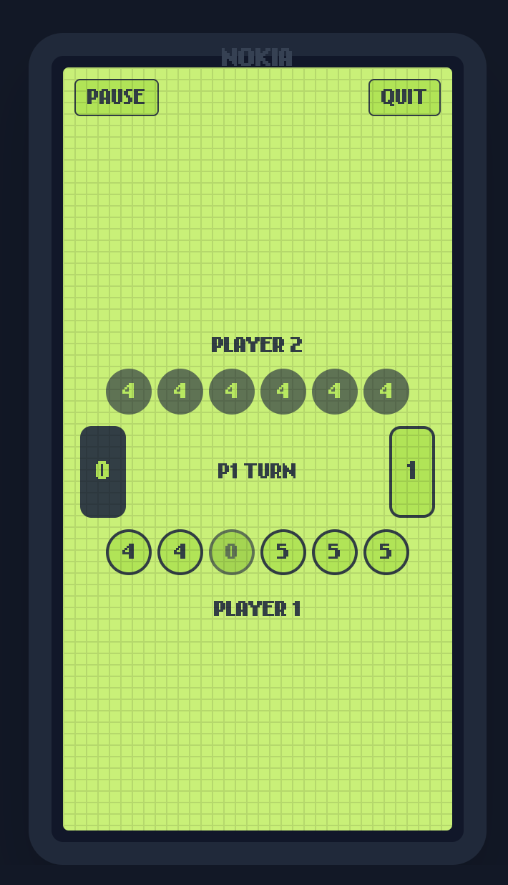

# [Bantumi Game App]

**Play now:** https://play-bantumi.vercel.app/

Welcome to the **Bantumi Game App** repository! This project is an implementation of the classic Bantumi (or Mancala) game, built primarily using **Next.js**, with additional support from **TailwindCSS**.

> **Vibe Coded by v0 and Github Copilot** ✨

## Table of Contents

- [About the Project](#about-the-project)
- [Screenshot](#screenshot)
- [Getting Started](#getting-started)
- [Usage](#usage)
- [License](#license)

## About the Project

The Bantumi Game App is a digital version of the traditional Bantumi board game. It aims to provide an engaging and interactive experience for users who want to play and enjoy this timeless game.

## Screenshots

Here’s a visual preview of the Bantumi Game App:
<div align="center">
   <picture>
      
   </picture>
   <picture>
      <source media="(max-width: 600px)" srcset="public/assets/screenshots/game.png">
      
   </picture>
</div>

## Getting Started

To get started with this project, follow these steps:

### Prerequisites

- Node.js installed on your machine
- A package manager like npm or yarn

### Installation

1. Clone the repository:

   ```bash
   git clone https://github.com/Zacharias02/bantumi-game-app.git
   cd bantumi-game-app
   ```

2. Install dependencies:

   ```bash
   npm install
   ```

3. Start the development server:

   ```bash
   npm run dev
   ```

## Usage

1. Open the app in your browser after running the development server.
2. Select your game settings and start playing!
3. Enjoy the Bantumi board game experience.

## License

This project is licensed under the MIT License. See the [LICENSE](LICENSE) file for details.
